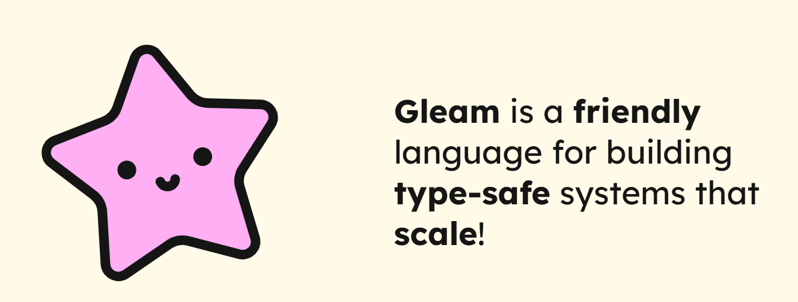

# Gleam ⭐

> The power of a type system, the expressiveness of functional programming, and the reliability of the highly concurrent, fault tolerant Erlang runtime, with a familiar and modern syntax.

- small language
- manageable [standard library](https://hexdocs.pm/gleam_stdlib/0.17.1/index.html)
- but **two targets**
    - Erlang on the BEAM virtual machine
    - JavaScript (not WASM)

## Structure of this repo 📂

0. [Just me learning the very basics of Gleam](./learn_basics/)
1. [A simple starter project to learn the basics](./vars/) (from https://gleam.run/writing-gleam/)
1. [An actor chat implementation to learn about actors](./chat_mini/)
1. [Websocket echo server](./echo_server/)
1. [Websocket echo client to learn about the javascript target](./echo_client/)

> **Devcontainer** 🚀 You can use the provided dev container to get the projects up and running.

## Some resources to learn about Gleam 📚

- [Gleam Language Tour](https://tour.gleam.run/)
- [Writing Gleam](https://gleam.run/writing-gleam/)
- [Learn OTP with Gleam](https://github.com/bcpeinhardt/learn_otp_with_gleam/tree/main) (for a deeper dive into the erlang/OTP world their [documentation](https://www.erlang.org/doc/readme.html) itself is probably the right place to start)
- [Gleam documentation collection](https://gleam.run/documentation/)
- [Lustre Framework Tour](https://gleamtours.com/lustre-tutorial/introduction/welcome-to-lustre/)
- *([Awesome Gleam](https://github.com/gleam-lang/awesome-gleam?tab=readme-ov-file#erlang-and-otp))*